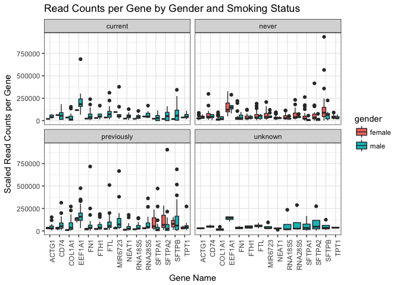
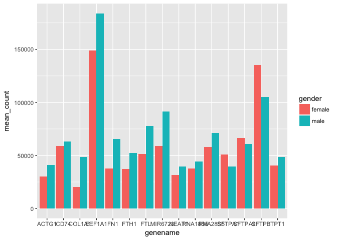
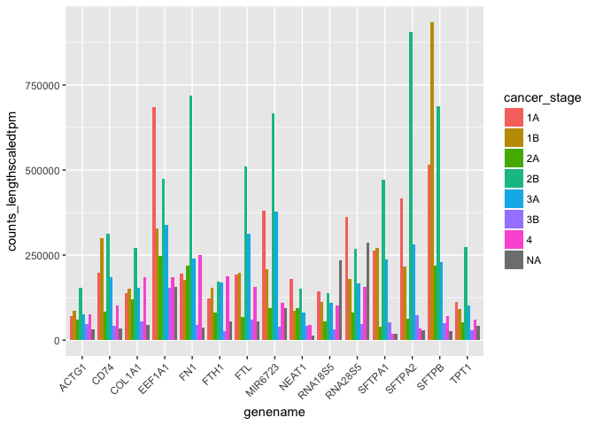
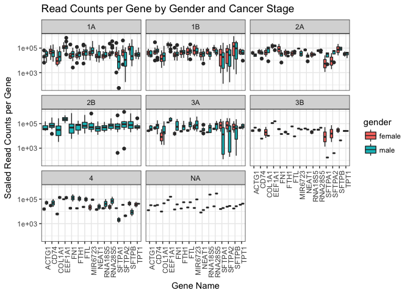

Analysis Report 2: Comparison of Gene Expression Levels in Male and Female Lung Cancer Patients
================
Isabella Finney
November 20, 2017

Introduction
============

The history of smoking in the world dates back to at least 4,000 BC. For much of history, the world used tobacco for different purposes such as trade, medicinal alleviation, and hallucinogenic uses. In the 20th century, smoking became a part of the mainstream culture as it was widely advertised and glamorized in the media by huge tobacco industries. It was not until the late 1980s, that research on the effects of tobacco and smoking started and soon after many results showed the gruesome results that tobacco and heavy smoking causes on the body as well as the ecosystem. From then on, policies, organizations, and campaigns have been enacted all over the world in an effort to reduce the negative effects it has caused to both people and the environment (Koh *et al.*, 2007).

The effects of smoking are damaging to nearly every organ in the body. Years of extensive research shows that exposure to smoking leads to years of damage to the body. Unfortunately, it is also the leading preventable cause of cancer and death in the world (Disease Control *et al.*, 2010). The development and application of modern molecular methods has made it possible for scientists to more fully understand how exactly smoking increases the risk for contracting various diseases and cancers in the body (Powell *et al.*, 2013). After doing much research, scientists were able to identity differences in molecular characteristics between smokers and nonsmokers who were diagnosed with lung cancer. For example, Massion et al. located structural differences in the genomes of smokers and nonsmokers with adenocarcinomas which help propose the idea that smoking affects the molecular pathways that form during cancer development (Massion *et al.*, 2008).

One of the most useful tools for investigating lung cancer development is RNA-seq technology. This technology helps in providing a tool for transcriptome analysis in studies. It presents a great utility for detecting tumor-associated genes as well as identifying of cancer pathogenesis because of its sensitivity and has less background noise from image analysis (Khoury *et al.*, 2013). The paper done by Li et al. examined the pair-wise comparison analysis on samples collected from a previous study that did RNA-seq analysis on paired normal and tumor tissues. This study aimed to distinguish the differences between gene expression profile between smoking and nonsmoking patients in the hopes of creating better individualized treatments (Li *et al.*, 2015). Using the dataset from this study, I investigated whether gender plays a risk factor in being more susceptible to contracting lung cancer. With the use of this dataset, I hypothesized that men would exhibit higher levels of gene expression in different cancer stages. I made this hypothesis due to the history associated with it being more acceptable for men to smoke. I also factored in statistics showing that overall, men had a higher mortality rate than women in cigarette smoking (Hammond, 1966).

Methods
=======

Sample origin and sequencing
----------------------------

Li et al. downloaded transcriptome sequencing data samples from the Gene Expression Omnibus or GEO (Li *et al.*, 2015). The data samples were taken from a study done by Seo et al. that took 68 patients with lung adenocarcinoma (34 non-smokers and 34 smokers). They restricted age to ensure comparability in age groups (Seo *et al.*, 2012). To compare the genes identified within the nonsmokers, Li et al. also imported an independent RNA-seq data set from GEO. Gene expression analysis was conducted on 136 RNA-seq bam files from each patient and pair-wise concordance were computed to confirm the paired nature of the tumor and normal tissues. The RNA-seq reads were aligned to human genome assembly via Tophat. HTSeq counted the reads and R Bioconductor edgeR preformed differential analysis with a linear model. The model aided in identifying the different genes expressed in tumor and normal tissues from smokers and nonsmokers. A logFC value was placed to count the significant genes. Pathway analysis was then applied to identify the relationships of the genes with varied expression.

Computational
-------------

The process to computationally parse and analyze the data gathered was accomplished using a systematic workflow from different scripts.The first step was to download an SRA toolkit for the RNA-seq analysis from NCBI. This allowed it to configure and download the directory and use aspera to quickly download the fastq files. Next, a script was created to download a reference genome with biomartr package from Bioconductor. This package can also annotate the wide range of genes from NCBI and achieve computational reproducibility (Durinck *et al.*, 2005). A for loop script was used to convert the paired-end SRA files to fastq files via fasta-dump. Another script was created that incorporated an aligner called sailfish to build and index for file for a reference genome. Sailfish quantifies the abundance of annotated RNA isoforms and provides faster quantification because it avoids mapping reads (Patro *et al.*, 2014). Fastqc was run in order to preform quality checks on all of the fastq files. Next, the Trimmomatic tool to clip off the Illumina adapters and any low quality reads below 20 in a window size of 4. Trimmomatic is such a valuable tool because it can handle preprocessing on paired-end data, with or without a reference (Bolger *et al.*, 2014). If any sequences were untrimmed in the first round, another script was made to retrim those sequences. Sailfish was run to count the reads from trimmed reads from Trimmomatic quality checks using 88 cores. The next R script made a conversion from transcripts to a gene ID mapping table. The result is a table with gene names of rows and columns of samples as well as a number of normalized counts of each gene in each sample. The last script was meant to consolidate all of the counts together and merge it with the metadata so that output comes in a nicely compressed csv format for easy readability and reproducibility for investigation in the Results section.

Results
=======

| genename |  mean\_count|
|:---------|------------:|
| EEF1A1   |    171057.69|
| SFTPB    |    116171.19|
| MIR6723  |     79496.49|
| FTL      |     67992.47|
| RNA28S5  |     66407.31|
| SFTPA2   |     62798.78|
| CD74     |     61554.19|
| FN1      |     55274.57|
| FTH1     |     46737.83|
| TPT1     |     45638.86|
| SFTPA1   |     43926.08|
| RNA18S5  |     41851.71|
| COL1A1   |     38104.70|
| ACTG1    |     37164.40|
| NEAT1    |     36768.17|

**Table 1**: The most highly expressed genes included are *SFTPB* and *EEF1A1*.

**Figure 1**: In this study, smoking status shows that overall, more males admitted to being current smokers or having smoked previously.

**Figure 2**: From the 15 most highly expressed genes, males, on average, show a higher expression count than females do.

**Figure 3**: This figure compares the highest expression levels of these 15 genes at each cancer stage. The majority of the genes show highest expression levels at stage 2B cancer.

**Figure 4**: Comparison of high expression levels by gender and cancer stage. Over every stage of cancer, expression levels in each gene are often slightly higher in males. Interestingly at stage 2B cancer, high expression levels are only seen in males. Male expression general grows higher at later cancer stages.

Discussion
==========

All of the figures for the results were formed through taking smaller sets of the whole metadata and outputting it in the form of different plots. Taking in the data presented from the 15 most expressed genes (Table 1), I determined that overall men experienced higher gene expression in later stages of cancer. Figure 1 shows that more males admitted to being current or previous smokers while the highest proportion of female expression dominants the “never” smoked category. To investigate how much gene expression is present in males and females among all lung cancer patients, males also hold higher expression rates than females do with a few exceptions including the *SFTPA1* and *SFTPB* genes. These figures helped in supporting part of my hypothesis in that male lung cancer patients exhibited higher gene expressions but it is interesting to note that female expression is not far enough from males.

These findings pushed me to further investigate if the second portion of my hypothesis held true in terms of this dataset. To investigate whether the second portion of my hypothesis held any validity, I considered the effect of gender gene expression on different cancer stages (Figures 3 and 4). Looking at gene expression and cancer stage, I examined that the highest expression levels among the majority of the genes were present in stages 1A and 2B lung cancer. Interestingly, gene expression lowers as later stages especially in stage 3B cancer. This shows that the most common genes do follow the trend of decreasing in expression as cancer stages progress. This interesting finding did present the possibility to further research whether this trend is present in most forms of cancer progression and not just present in this dataset. I finally examine the relationship between different cancer stages as they relate to gene expression and gender. The results from this graph showed that over each stage of cancer, males exhibited slightly higher expression levels and these expressions grow higher at later cancer stages. The most interesting part of this data is that only males express very high expressions at stage 2B lung cancer. An important factor to keep in mind is that my figures are based on the top 15 genes with the highest expression overall so there may be some genes present within these patients that are drastically different than the general trends observed so further research on this data should be conducted.

Sources Cited
=============

Bolger,A.M. *et al.* (2014) Trimmomatic: A flexible trimmer for illumina sequence data. *Bioinformatics*, **30**, 2114–2120.

Disease Control,C. for *et al.* (2010) How tobacco smoke causes disease: The biology and behavioral basis for smoking-attributable disease: A report of the surgeon general.

Durinck,S. *et al.* (2005) BioMart and bioconductor: A powerful link between biological databases and microarray data analysis. *Bioinformatics*, **21**, 3439–3440.

Hammond,E.C. (1966) Smoking in relation to the death rates of one million men and women.

Khoury,J.D. *et al.* (2013) The landscape of dna virus associations across human malignant cancers using rna-seq: An analysis of 3775 cases. *Journal of virology*, JVI–00340.

Koh,H.K. *et al.* (2007) Making smoking history worldwide. *New England Journal of Medicine*, **356**, 1496–1498.

Li,Y. *et al.* (2015) RNA-seq analysis of lung adenocarcinomas reveals different gene expression profiles between smoking and nonsmoking patients. *Tumor Biology*, **36**, 8993–9003.

Massion,P.P. *et al.* (2008) Smoking-related genomic signatures in non–small cell lung cancer. *American journal of respiratory and critical care medicine*, **178**, 1164–1172.

Patro,R. *et al.* (2014) Sailfish enables alignment-free isoform quantification from rna-seq reads using lightweight algorithms. *Nature biotechnology*, **32**, 462–464.

Powell,H.A. *et al.* (2013) The association between smoking quantity and lung cancer in men and women. *CHEST Journal*, **143**, 123–129.

Seo,J.-S. *et al.* (2012) The transcriptional landscape and mutational profile of lung adenocarcinoma. *Genome research*, **22**, 2109–2119.
